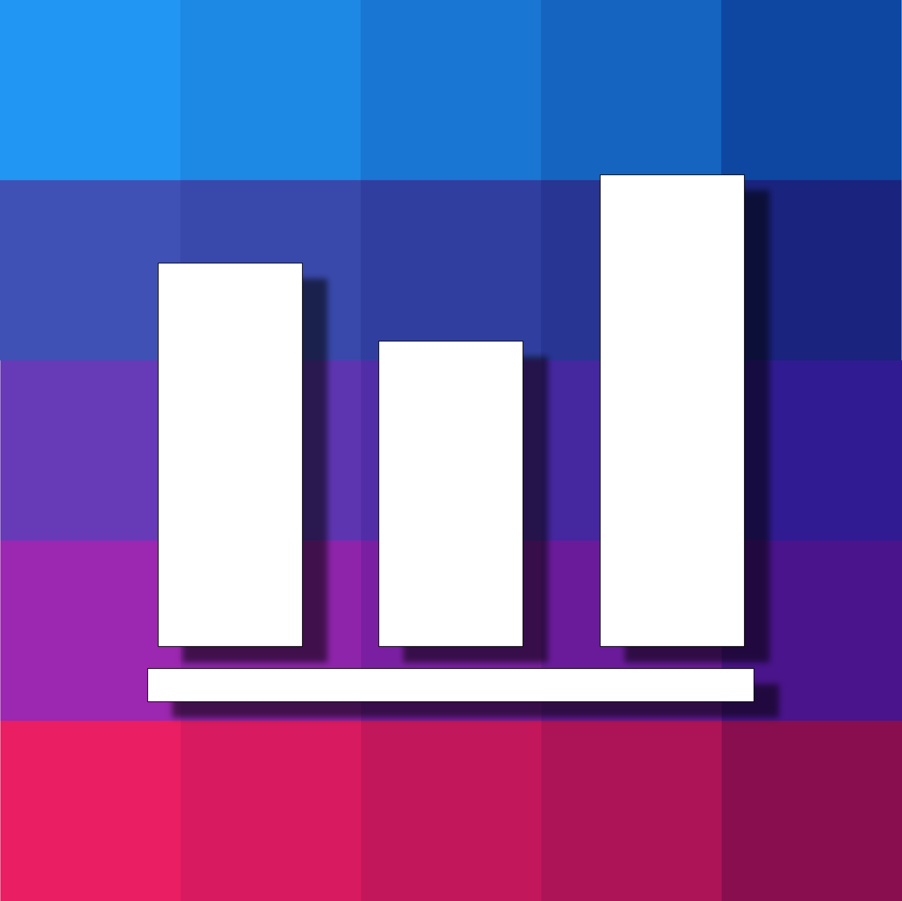

  

# ChartVision

An accessibility-focused app for the vision-impaired.

## What is it for?

ChartVision is an app to help the visually impaired interact and explore data charts.

Visually impaired people interact with technology using especial programs that can read back to them the textual content of the screens of their devices, but those programs lack the ability to read the content of images (including the content of data chart images).
Data charts are an important medium to convey data and more often than not the data presented in charts is not also available in textual forms, so the user can't access that data. ChartVision is an app that allows the user to load data charts into their devices and interact with them through touch to explore the contents of the charts. The contents of the charts are read back through synthesized speech using description templates that have been scientifically proposed and tested to guarantee maximum comprehension. 

The vocalization templates that were proposed and validated were published in the form of a full-paper in the 23rd International Conference Information Visualisation, that took place in Paris - France, in July 2019.

The paper is available in the IEEE Explore Repository and can be accessed through the link below:
 - [Proposal and Evaluation of Textual Description Templates for Bar Charts Vocalization](https://github.com/AlanTas/ChartVision_flutter/raw/master/Monografia%20-%20Alan_Trindade.pdf)

## Why flutter?

The first prototype of the app was built using native android, that although functional means that if it becomes desirable to develop an iOS version two codes would have to be maintained. 
Flutter is a framework developed by Google that allows apps to be generated for Android, iOS, Desktop and Web under the same source code, making it easier not only to maintain the code but also to guarantee consistency across platforms.

The app is currently being ported to flutter. The native Android version repository was set to private.

## Want to know more?

This project was developed as part of my undergraduate thesis, the full text is available in the link below (Portuguese):
 - [ChartVision: Gráficos de Barras Acessíveis](https://ieeexplore.ieee.org/document/8812129)

